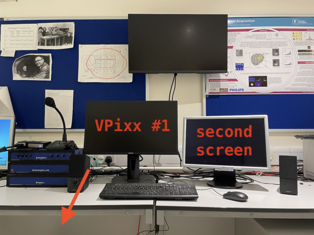
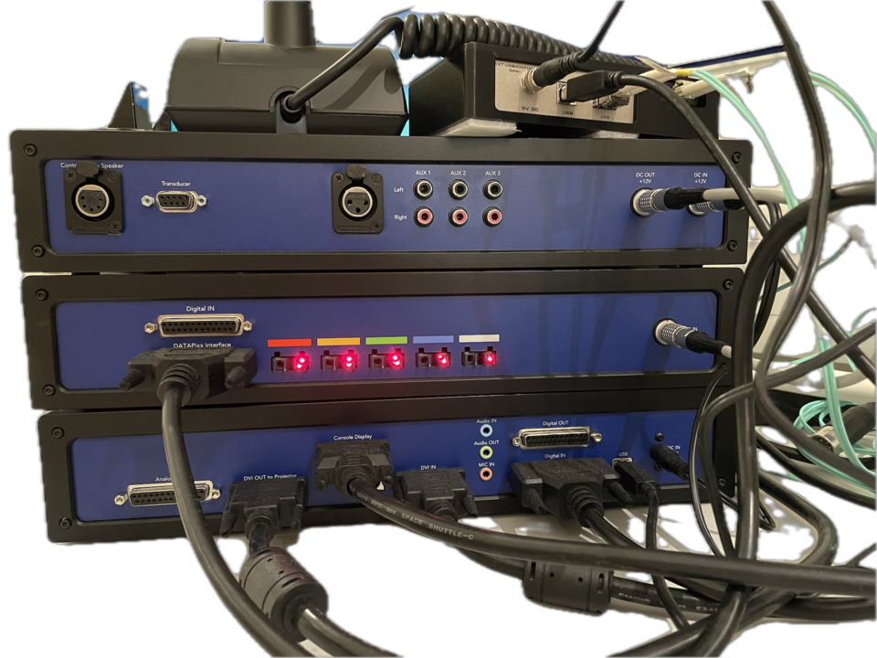
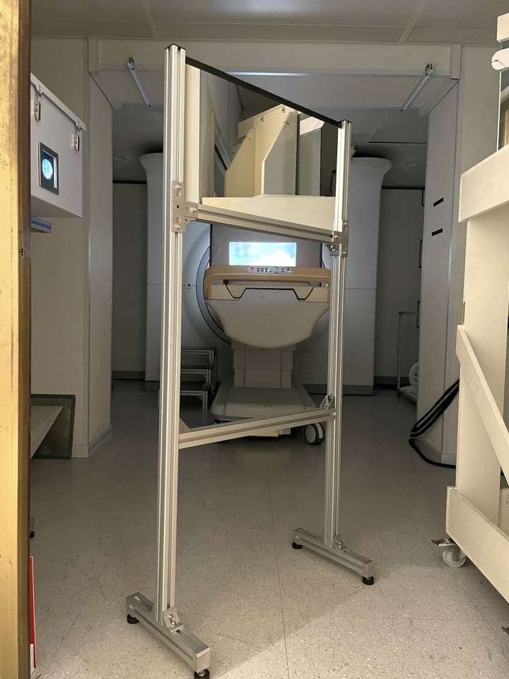

# `VPixx` system on the 7T

This page provides information and some visual stimulus code for the 7T, notes for running the  `VPixx` system on the dedicated machine with `octave`+`Psychtoolbox` under the `ubuntu` install. 

<center>

<caption>
Coding on macOS (`x86_64` version of `octave`)
</caption>
</center>

## General points

- we have a `PROPixx` display system with additional kit for **audio**, two sets of **button boxes** for participant responses, and **analogue and digital I/O** for connecting up other equipment (and a stereo/3D component that can be used to deliver dichoptic stimuli)
- the projector lives in the scanner room in a shielded box and stimuli are displayed on a custom-made screen via a front-surface mirror at the foot-end of the scanner bed
- the dedicated computer can be booted into two different OSes:
  1. `ubuntu` (Linux), which can be used to run code with `gnu/octave` and `Psychtoolbox`
  2. `Windows 11` for running `python` code with `PsychoPy`
- switching the projector on/off is via software. You can use the `PyUtil` tool under both `ubuntu` and `Windows` partitions or `vputil` command in Terminal.

## Asking a question, raising issues

- For a quick overview, you can watch [this presentation/talk](https://echo360.org.uk/media/86dfcae6-d21f-4bef-8351-99dabf482028/public) on the system. Some things will have moved on a bit, but it provides a good introduction to what's available and what to think about.

- You can find some documentation below and sample code to clone in the associated [the github repo](https://github.com/nottingham-neuroimaging/7T-visual-code).

- If you get stuck or have a problem you can [raise an issue on github repo](https://github.com/nottingham-neuroimaging/7T-visual-code/issues) and also try pinging the [SPMIC Imaging for Neuroscience usergroup](https://teams.microsoft.com/l/channel/19%3Af45ef16dd5af4e9b808ba62cb2f6538c%40thread.skype/Imaging%20for%20Neuroscience?groupId=9b568a79-be78-46dc-be5c-d74bfec144e7&tenantId=67bda7ee-fd80-41ef-ac91-358418290a1e) for some advice and so we know.

## What does it look like?

The setup is made up of a stack of hardware blocks (PROPixx, ResponsePixx, ...) and there are two displays in the console room. One "mirrors" what the participant sees, the other can be used to keep an eye on the software running your experiments.

<p float="left">
    
    
    
</p>

The front surface mirror is positioned to project the image (from the `PROPixx` box on the left towards the participant in the bore).

This mirror is required inside the scanner room to redirect the projected image onto the display screen, which is suspended from the ceiling.

**Be very careful when moving the mirror into place** and avoid touching the mirror surface itself (it is a front surface mirror, so doesn't have a protective glass coating - finger prints can permanently damage it).

## Switching on the projector

This is done is software - the power to the projector should always be on, so you can use a software call to *wake/sleep* the projector. (You may have to check a switch in the breaker/box in the equipment room to the left of the scanner room to make sure).

- in the `PyUtil` GUI programme, you should see a button in the menu bar called **Wake ProPIXX** (or **Sleep ProPIXX** if it is currently on).
- from the command line, if you prefer, you can call the `vputil` command
  
```bash
# either start the command line utility and follow meny into 
# "System commands" - by entering 0
vputil

# or straight away
vputil -ppx a # awake
vputil -ppx s # sleep
```

**Make sure that you swith the projector off at the end of your experiment.**

## Sample code for testing

- `testKeysSPMIC()` - for some code that tests the response box and triggering
- `SPMIC_demo_01` - grabs display, puts a yellow dot on the screen and moves it. For checking whether `VPixx` display gets picked up etc
- `SPMIC_demo_02` - simple implementation of a block design (static and moving faces, static objects, gray background). Timing can be adjusted pretty easily - has some opinionated suggestions on how to organise code.
- `ProceduralNoiseForObjects` - how to make dynamic noise using GPU (rather than pre-computed images and blitting them). Still needs some debugging re ALPHA blending to make it work with background suppression in movie / masked image stimuli
- `movie_test_{01,02}` - initial movie testing to check that movies can be loaded ok and display on screen. working.

## Triggering

Syncing stimulus timing with data acquisition on the scanner is a crucial aspect of running a successful functional MRI experiment.

The `ResponsePixx` blocks that are part of our setup allow for really precise timing at or better than the frame rate of display.

**The BNC connector that sends the trigger from the scanner should go into pin 10 (`Din10`) on the `ResponsePixx` input box.**

This is to make sure that there is no clash with the 10 possible inputs (from `Din00` to `Din09` for the two-paddle response box).

- Here are [some details (and code examples)](./octave-triggering.md) of how to get the scanner trigger and button presses via `octave/Psychtoolbox`
- To trigger your `PsychoPy` experiment, looks for details here [to come!]

## To-dos (some physical)

- [x] add a second display for coding (current console room display mirrors projector). Done. Thanks to AP. Setup on `ubuntu` now also allows for non-mirrored 2nd display
- [x] document minimal test code + examples
- [x] document (SOP) for switching on/off projector, how to bring your own code, etc.
- [x] test 45º mirror for projecting along line of bore + screen material
- [x] provide guidance to those wanting to write code away from console room (eg [coding / debugging on MacOS/Apple hardware](./macos-notes.md) requires some additional hoop-jumping)
- [x] triggering via `ResponsePixx` system. Code that uses the Digital IN demo snippets from `VPixx` documentation. Working.
- [ ] `python` route for triggering via `ResponsePixx` system. Code that uses the Digital IN demo 

## Initial vision experiment for `UHFVIS` project

Some notes and a [scanning-readme](./vision-experiment.md) for getting off the ground.

## Documentation from `VPixx` website 

Trying out a couple of provided demos to test digital IO and also ProPIXX display capabilities:

<https://www.vpixx.com/manuals/psychtoolbox/html/intro.html>

## Contact

For now: <denis.schluppeck@nottingham.ac.uk> and you can also try the [SPMIC Imaging for Neuroscience usergroup](https://teams.microsoft.com/l/channel/19%3Af45ef16dd5af4e9b808ba62cb2f6538c%40thread.skype/Imaging%20for%20Neuroscience?groupId=9b568a79-be78-46dc-be5c-d74bfec144e7&tenantId=67bda7ee-fd80-41ef-ac91-358418290a1e).
